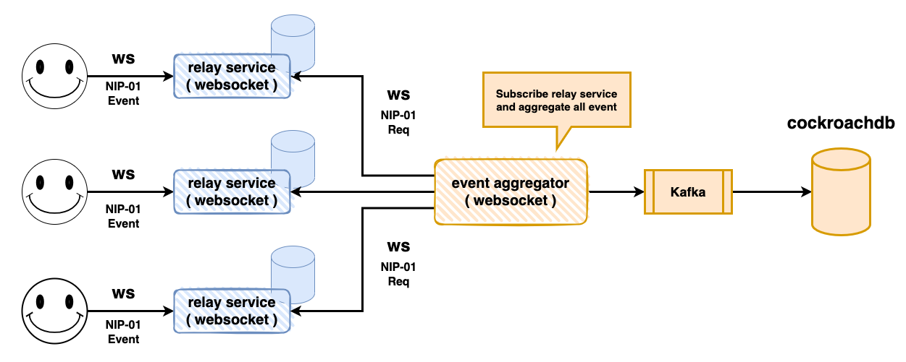
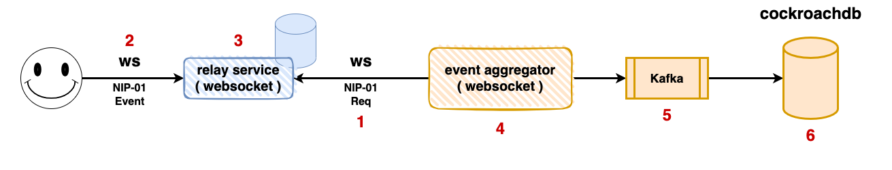

## Description

The architecture of the DISTRISE




### Process



1. The event aggregator service send the req(NIP-01) to relay service.
2. The client send a message event(NIP-01) to the relay service.
3. The relay service receive the message event(NIP-01) and send it to the event aggregator service through the websocket.
4. The event aggregator service receive the message event(NIP-01) and send it to the kafka(queue service).
5. The kafka(queue service) consume the message event(NIP-01) and save it to the cockroachdb(database service).


## Installation

```bash
$ npm install
```

## Running the Client 


```
npm run script send {message}
```

# Questions

## Session 1

#### 1. What are some of the challenges you faced while working on Phase 1?

* Designing the architecture of the application, and how to make it support phase 2~5 
* Write the code in a way that is easy to maintain and extend
* Write the part of the NIP-01 protocol, because I don't have a lot of experience with the protocol


#### 2. What kind of failures do you expect to a project such as DISTRISE to encounter?

* The DISTRISE server is a websocket server, so it is possible that the server will encounter a lot of long connections, and the server will face the problem of resource exhaustion. For example the number of file descriptors is exhausted. the other is the cpu resource exhaustion problem due to the large number of connections and emit events.
* The DISTRISE server has a log of encode and decode, so it is possible that the server will encounter a cpu resource exhaustion problem.

---
## Session 2

#### 1. Why did you choose this database?

The key point of the database is that it can easy scale, because the number of events to be stored will be huge.So, I have two choices, one is the mongodb and the other is the cockroachdb.

I will choose the cockroachdb, because I have't any experience with the cockroachdb, and I want to learn it.

#### 2. If the number of events to be stored will be huge, what would you do to scale the database?

---
## Session 3

#### 1. Why did you choose this database? Is it the same or different database as the one you used in Phase 2? Why is it the same or a different one?

same as the one I used in Phase 2, because I choice the cockroachdb.

#### 2. If the number of events to be stored will be huge, what would you do to scale the database?

- Partitioning
- Sharding

It is easy to scale the cockroachdb, because it is a distributed database.

---
## Session 4

#### 1. Why did you choose this solution?

my requirements are:

- The solution should be easy to scale. because the number of events to be send will be huge.
- The solution should have durability. because the events are important.
- The event aggregator does not need to order the events. because the events are independent.
- The event aggregator does not need to be consistent.

So I choose the kafka, because it is a distributed message queue, and it is easy to scale.

#### 2. If the number of events to be stored will be huge, what would you do to scale your chosen solution?

- Kafka Topic Partitioning


---
## Session 5

#### 1. Why did you choose these 5 metrics?

* Request(rps): it can reflect the number of requests received by the server.
* Saturation: amount of work that a system is handling at any given time.
* CPU Usage: it can reflect the cpu resource usage of the server. 
* Memory Usage: it can reflect the memory resource usage of the server. it is important on websocket server, because the websocket server will keep a lot of connections.
* Errors Rate: how many you unexpected errors occur, it means the quality of the code.

#### 2. What kind of errors or issues do you expect them to help you monitor?

* 

#### 3. If you had more time, what other tools would you use or metrics would you instrument and why?

* k8s: it can help me to deploy the application easily. and auto scale the application.
* prometheus: it can help me to monitor the application easily.

## License

The project [MIT licensed](LICENSE).
